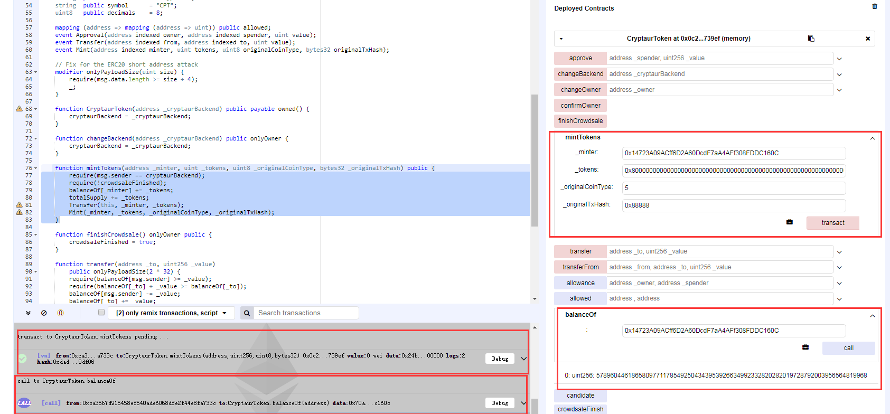
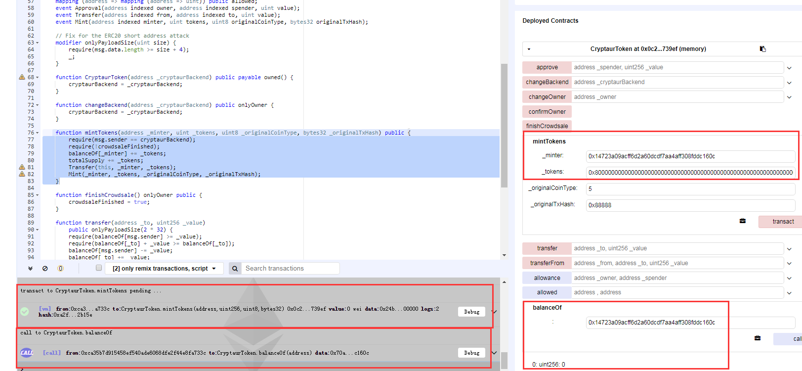

### Cryptaur (CPT)
https://etherscan.io/address/0x88d50b466be55222019d71f9e8fae17f5f45fca1#code


```javascript
	  function mintTokens(address _minter, uint _tokens, uint8 _originalCoinType, bytes32 _originalTxHash) public {
        require(msg.sender == cryptaurBackend);
        require(!crowdsaleFinished);
        balanceOf[_minter] += _tokens;
        totalSupply += _tokens;
        Transfer(this, _minter, _tokens);
        Mint(_minter, _tokens, _originalCoinType, _originalTxHash);
    }
```

In function mintToken(),the Cryptaur (CPT) token could be minted by it’s administrator arbitrarily.The balanceOf[target] and mintedAmount are defined as uint256, so operator '+' would trigger a integer overflow by a crafted value of mintedAmount.

Simulated In Remix:

Administrator can mint a arbitrary mount of tokens to a target account , for example 0x8000000000000000000000000000000000000000000000000000000000000000 Wei:



Next step , Administrator mint a crafted amount(0x8000000000000000000000000000000000000000000000000000000000000000) of token to a target account , trigger a integer overflow :



And now the balance of target account overflow to be zero.

what's more , there is a overflow with "totalSupply += mintedAmount" , then Administrator could create more coins than they predetermined.

And actually the Administrator could control the target account's balance to be an arbitrary value.

