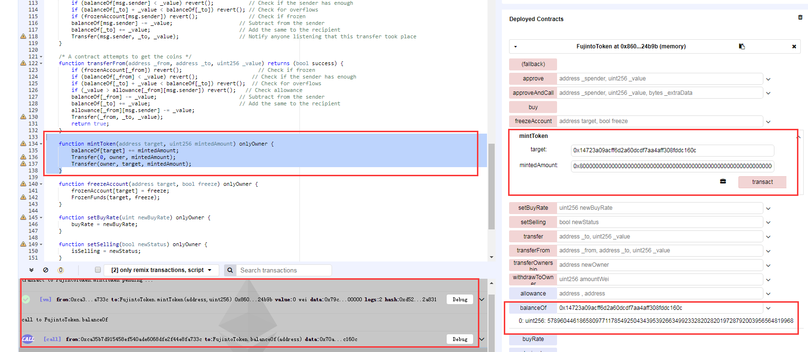
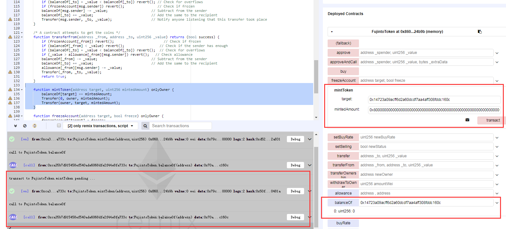

### Fujinto (NTO)
https://etherscan.io/address/0x8a99ed8a1b204903ee46e733f2c1286f6d20b177#code


```javascript
	
    function mintToken(address target, uint256 mintedAmount) onlyOwner {
        balanceOf[target] += mintedAmount;
        Transfer(0, owner, mintedAmount);
        Transfer(owner, target, mintedAmount);
    }
```

In function mintToken(),the Fujinto (NTO) token could be minted by it’s administrator arbitrarily. The balanceOf[target] and mintedAmount are defined as uint256, so operator '+' would trigger a integer overflow by a crafted value of mintedAmount.

Simulated In Remix:

Administrator can mint a arbitrary mount of tokens to a target account , for example 0x8000000000000000000000000000000000000000000000000000000000000000 Wei:



Next step , Administrator mint a crafted amount(0x8000000000000000000000000000000000000000000000000000000000000000) of token to a target account , trigger a integer overflow :



And now the balance of target account overflow to be zero.

And actually the Administrator could control the target account's balance to be an arbitrary value.

