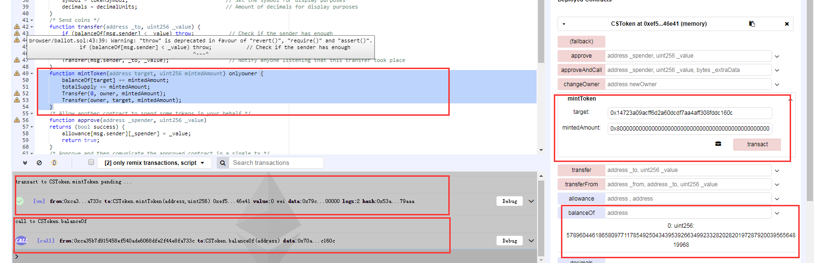
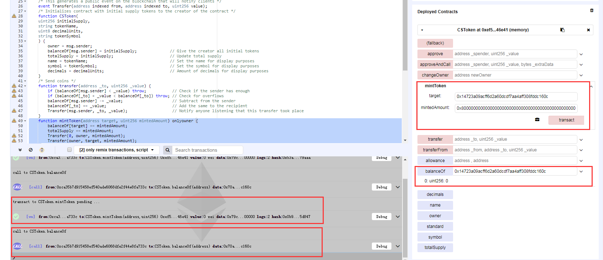

### MyBit Token (MyB)
https://etherscan.io/address/0x94298f1e0ab2dfad6eeffb1426846a3c29d98090#code

```javascript
	function mintToken(address target, uint256 mintedAmount) onlyowner {
		balanceOf[target] += mintedAmount;
		totalSupply += mintedAmount;
		Transfer(0, owner, mintedAmount);
		Transfer(owner, target, mintedAmount);
	}
```

In function mintToken(),the MyBit Token token could be arbitrary minted by it’s administrator.The balanceOf[target] and mintedAmount are defined as uint256, so oprator '+' would trigger a integer overflow by a crafted value of mintedAmount.

Simulated In Remix:

Administrator can mint a arbitrary mount of tokens to a target account , for example 0x8000000000000000000000000000000000000000000000000000000000000000 Wei:



Next step , Administrator mint a crafted amount(8000000000000000000000000000000000000000000000000000000000000000) of token to a target account , trigger a integer overflow :



And now the balance of target account overflow to be zero.

And actually the Administrator could control the target account's balance to be an arbitrary value.

