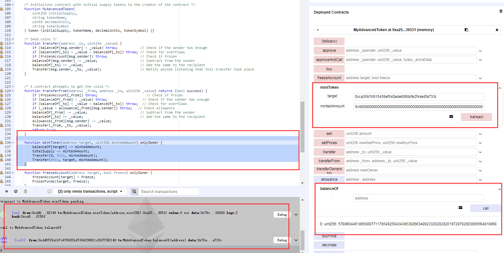
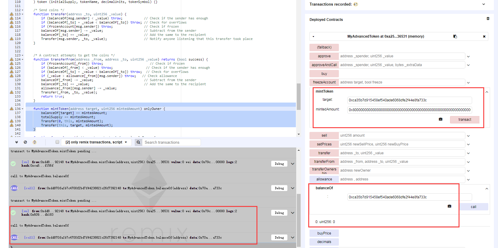

###  Substratum (SUB)
https://etherscan.io/address/0x12480e24eb5bec1a9d4369cab6a80cad3c0a377a#code


```javascript
	
     function mintToken(address target, uint256 mintedAmount) onlyOwner {
        balanceOf[target] += mintedAmount;
        totalSupply += mintedAmount;
        Transfer(0, this, mintedAmount);
        Transfer(this, target, mintedAmount);
    }
```

In function mintToken(),the  Substratum (SUB) token could be minted by it’s administrator arbitrarily. The balanceOf[target] and mintedAmount are defined as uint256, so operator '+' would trigger a integer overflow by a crafted value of mintedAmount.

Simulated In Remix:

Administrator can mint a arbitrary mount of tokens to a target account , for example 0x8000000000000000000000000000000000000000000000000000000000000000 Wei:



Next step , Administrator mint a crafted amount(0x8000000000000000000000000000000000000000000000000000000000000000) of token to a target account , trigger a integer overflow :



And now the balance of target account overflow to be zero.

what's more , there is a overflow with "totalSupply += mintedAmount" , then Administrator could create more coins than they predetermined.

And actually the Administrator could control the target account's balance to be an arbitrary value.

